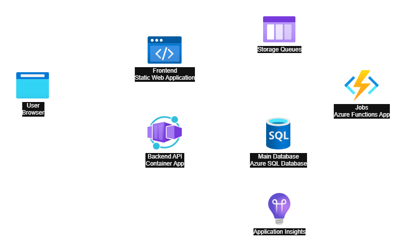

# RateMyPet

RateMyPet is a social site where users can share photos and stories about their pets, and rate each other's pets. The idea is to create a fun and engaging community for pet lovers to connect and share their love for animals.

The production version of the site can be found [here](https://ratemy.pet)

## Technology Stack

- **Frontend**: Angular, SCSS
- **Backend**: ASP.NET Core Web API, Azure Functions
- **Database**: Azure SQL Database
- **Cloud Services**: Azure Container Apps, Azure Functions, Azure Blob Storage, Azure Queue Storage, 

## Architecture

This is a relatively simple web application but it does have a few moving parts. Most of the infrastruture is hosted in Azure. 

- Static Web App - serves the frontend SPA files via a global CDN
- Backend API - Azure Container app which hosts the ASP.NET Core Web API
- Azure Functions - used for background processing such as sending emails and processing images

Here is a diagram of the architecture:

